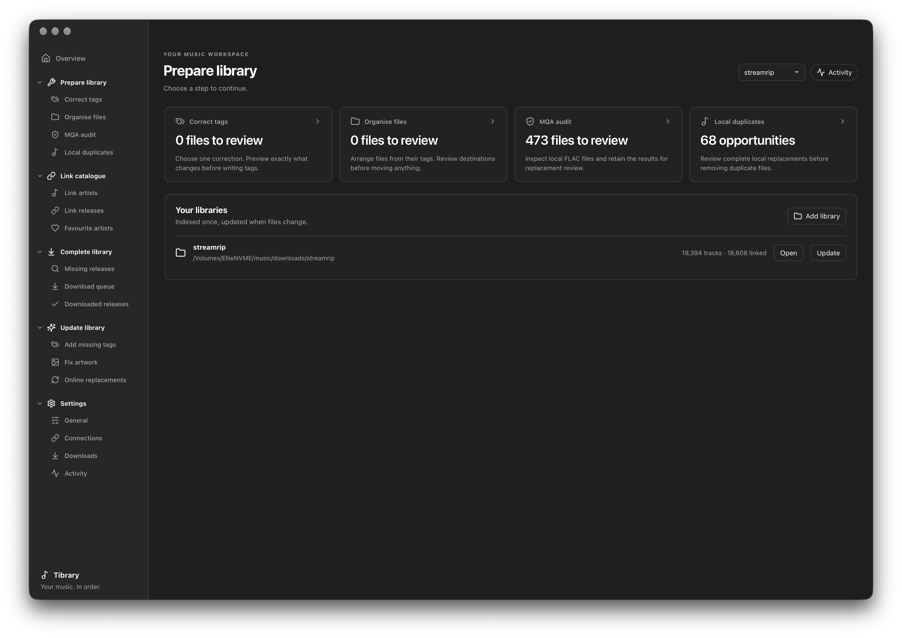
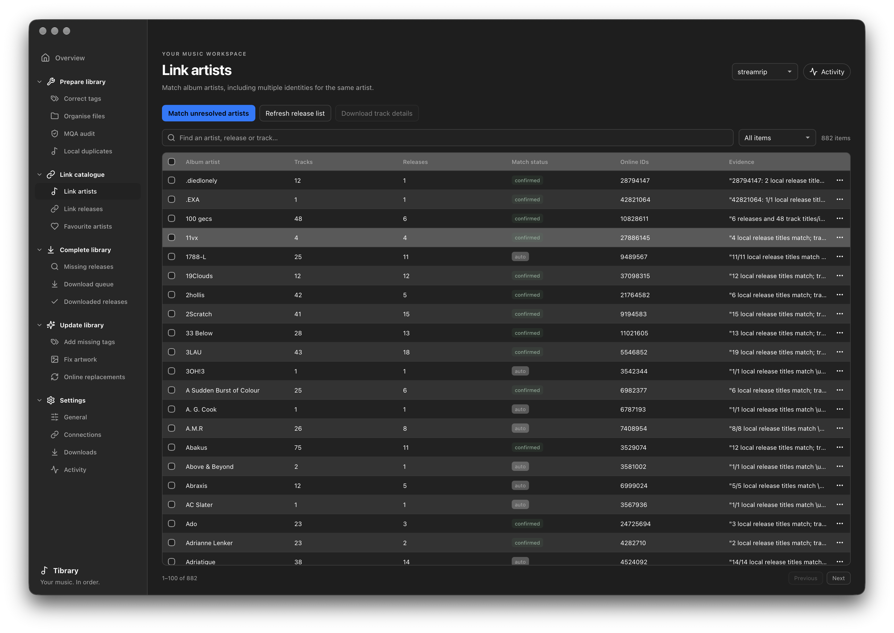
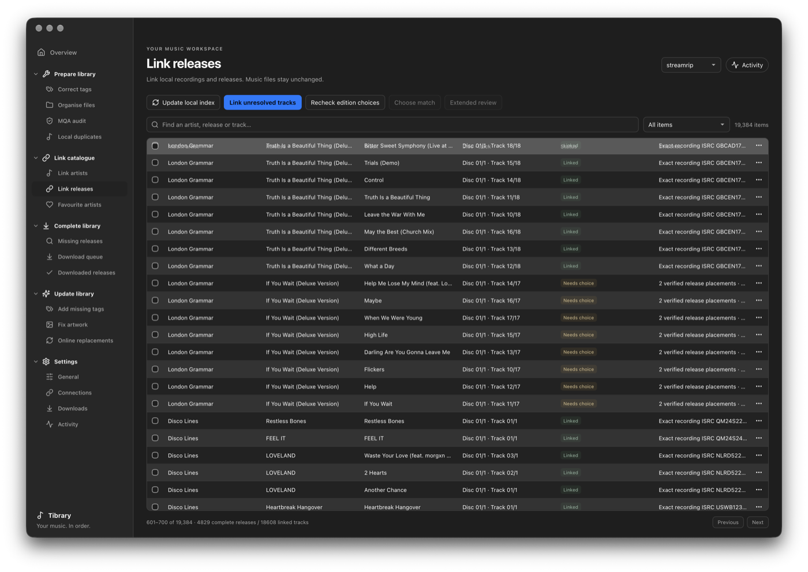
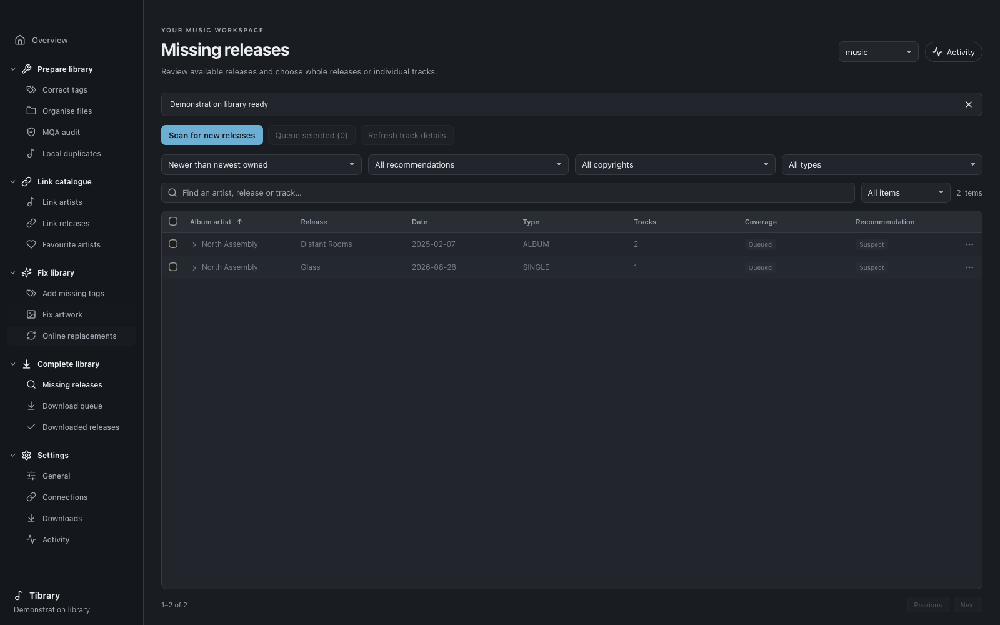
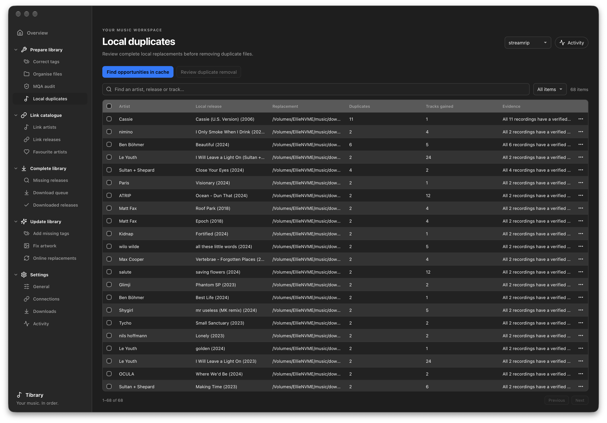
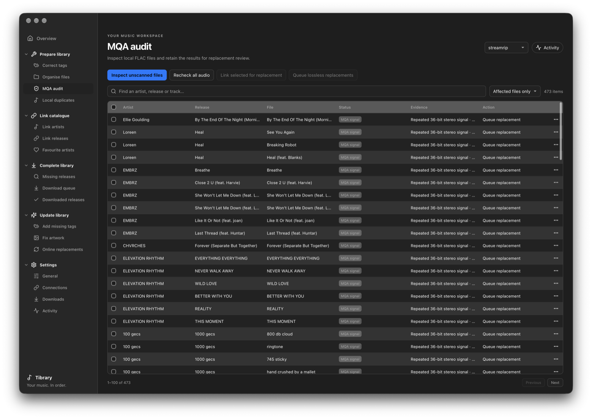
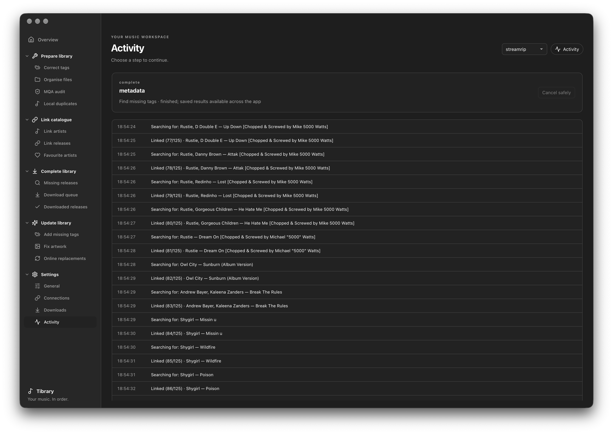

<div align="center">

# Tibrary 🎵

**A high-performance, local-first music library manager and Tidal companion app.**

Scan local libraries in milliseconds, link tracks to the streaming catalogue with deterministic precision, uncover missing discography releases, audit authentic MQA streams, and safely manage tags—all with complete user approval.

[](https://www.rust-lang.org/)
[](https://v2.tauri.app/)
[](https://react.dev/)
[](https://turso.tech/libsql)
[](LICENSE)

<br/>


</div>

---

## 🌟 Overview

**Tibrary** is purpose-built for DJs, collectors, and audiophiles who maintain large local lossless music collections and want their local library organized, tagged, and synchronized with Tidal's catalogue.

The guiding principle of Tibrary is:  
**Scan once, match deterministically, review clearly, and change or download only with explicit approval.**

Catalogue matching and gap detection run safely and non-destructively. Local files are never modified, retagged, renamed, moved, or deleted without an interactive preview and explicit confirmation.

---

## ✨ Features

- ⚡ **Sub-Millisecond Incremental Scanning:** Powered by native Rust and [Lofty](https://github.com/Serial-ATA/lofty-rs). Recursively indexes thousands of FLAC, ALAC, MP3, WAV, and AIFF files using high-resolution modification timestamps and file sizes to skip unchanged files instantly.
- 🎯 **Deterministic Catalogue Linking:** Matches local releases to Tidal catalogue entities using multi-evidence scoring: exact ISRCs, track durations (±3s window), multi-disc alignments, edition variants (Deluxe, Remaster, Explicit), and whole-release structure. Never relies on blind title searches alone.
- 🔍 **Missing Music Discovery:** Cross-references confirmed local artist holdings against complete Tidal discographies (Albums, EPs, Singles) to identify missing releases, historical catalogue gaps, and incomplete albums.
- 🔬 **Authentic MQA Signal Audit:** Runs a bit-accurate 36-bit stereo-XOR sync pattern detector directly on raw PCM audio frames to distinguish authentic MQA streams from standard lossless audio and misleading file tags.
- 🗃️ **Duplicate & Replacement Inspection:** Identifies duplicate tracks across disks and directories, scoring bit depth, sample rates, and tags so you can keep the best edition.
- 🏷️ **Non-Destructive Tag & Folder Maintenance:** Previews tag normalizations (leading zeros, Camelot `INITIALKEY` conversions, BPM standardization) and directory reorganizations (`Artist/Album (Year)/Track - Title`). Rewrites metadata in-place using FLAC padding blocks, preserving bit-exact audio streams verified by SHA-256 frame hashing.
- 📥 **Acquisition Queue & Fulfilment:** Persistent, reviewable acquisition queue. Export approved items as URLs/JSON/CSV, or dispatch them directly to an isolated on-demand [Tidaler](https://github.com/maya-doshi/tidaler) background download worker.
- 🛡️ **Local-First & Privacy-Focused:** All metadata, matches, and caches are stored locally in an embedded [Turso/libsql](https://github.com/tursodatabase/libsql) SQLite database. Tidal tokens are managed securely in the OS credential store and never exposed in logs or plaintext files.

---

## 🖼️ Visual Tour

### 1. Prepare & Clean Library
Inspect local folders, reconcile modified files, audit for unwanted MQA streams, and resolve local duplicate tracks before linking.
<div align="center">
  
</div>

<br/>

### 2. Link Artists & Disambiguate Entities
Map local artists to verified Tidal artist profiles across multi-artist collaborations, alias variations, and split tracks.
<div align="center">
  
</div>

<br/>

### 3. Match Releases Deterministically
Map local tracks to definitive streaming catalog releases using ISRC matching, track lengths, and edition selections without altering your audio tags directly.
<div align="center">
  
</div>

<br/>

### 4. Spot Missing Music & Build Acquisition Queue
Audit discographies of favourite artists, pinpoint uncollected releases, singles, or bonus tracks, and stage them for retrieval.
<div align="center">
  
</div>

<br/>

### 5. Review Local Duplicates
Compare audio formats, bitrates, sample rates, and file paths to consolidate multiple editions safely.
<div align="center">
  
</div>

<br/>

### 6. MQA Protocol Audit
Verify whether lossless FLAC files contain authentic MQA bitstreams using in-depth PCM frame inspection.
<div align="center">
  
</div>

<br/>

### 7. Real-Time Activity Log
Monitor background tasks, API rate limiting, scan progress, and database synchronization in real time.
<div align="center">
  
</div>

---

## 🏗️ Architecture

```
┌────────────────────────────────────────────────────────────────────────┐
│                        React 19 Desktop UI                             │
│   • TypeScript · Tailwind CSS · Lucide Icons · Vite                    │
│   • Virtualized Data Tables (Multi-Sort, Multi-Select, Cascades)       │
│   • Reactive State Synchronization via Atomic Database Revisions       │
└───────────────────────────────────┬────────────────────────────────────┘
                                    │ Tauri v2 IPC / CLI JSON-RPC
┌───────────────────────────────────┴────────────────────────────────────┐
│                       Native Rust Backend Engine                       │
│  ┌───────────────────────────────┬──────────────────────────────────┐  │
│  │ Storage & Data Services       │ Audio & Format Services          │  │
│  │ • Turso / libsql Embedded DB  │ • Lofty Metadata Engine          │  │
│  │ • Schema Migrations           │ • FLAC Padding-Aware Tag Writer  │  │
│  │ • Atomic Revision Tracking    │ • 36-Bit Stereo-XOR MQA Detector │  │
│  │ • Fast Bulk Indexing          │ • Audio Frame SHA-256 Hashing    │  │
│  ├───────────────────────────────┼──────────────────────────────────┤  │
│  │ Networking & Catalogues       │ Matching & Resolution            │  │
│  │ • Native reqwest Tidal Client │ • Multi-stage Candidate Linker   │  │
│  │ • Token Lifecycle Management  │ • Whole-Release Structure Gates  │  │
│  │ • Exponential Backoff & Cache │ • ISRC & Duration Tolerances     │  │
│  └───────────────────────────────┴──────────────────────────────────┘  │
└───────────────────────────────────┬────────────────────────────────────┘
                                    │ Isolated CLI Execution
┌───────────────────────────────────┴────────────────────────────────────┐
│                    On-Demand Download Worker                           │
│     Tidaler (Python 3.12+) — Executed strictly for active downloads    │
└────────────────────────────────────────────────────────────────────────┘
```

---

## 🚀 Getting Started

### Prerequisites

- **macOS** 13+ (Apple Silicon or Intel), **Linux**, or **Windows 10/11**
- **Rust** 1.80+: [rustup.rs](https://rustup.rs/)
- **Node.js** 20+ or 22+ with **npm**: [nodejs.org](https://nodejs.org/)
- **Python** 3.12+ *(Optional, only required if executing streaming downloads via Tidaler)*

### Quick Start (Development)

1. **Clone the repository:**
   ```sh
   git clone https://github.com/your-username/tibrary.git
   cd tibrary
   ```

2. **Install frontend dependencies:**
   ```sh
   npm --prefix desktop ci
   ```

3. **Run in development mode:**
   ```sh
   npm --prefix desktop run tauri dev
   ```

4. **Launch with macOS helper script:**
   ```sh
   ./Start.command
   ```

### Building for Release

To compile the optimized native binary and produce the standalone `.app` and `.dmg`:
```sh
npm --prefix desktop run tauri build
```
The compiled macOS bundle will be located at:
`desktop/src-tauri/target/release/bundle/macos/Tibrary.app`

---

## 🧪 Testing Suite

Tibrary features a comprehensive multi-tier test suite:

```sh
# 1. Run all Rust unit and integration tests (DB, Lofty, MQA, Matching, Tidal API)
cargo test --manifest-path desktop/src-tauri/Cargo.toml --bin tibrary

# 2. Strict Rust linter check (0 warnings allowed)
cargo clippy --manifest-path desktop/src-tauri/Cargo.toml --bin tibrary -- -D warnings

# 3. Run React frontend unit tests (Vitest)
npm --prefix desktop test

# 4. Run Playwright end-to-end tests against native Rust RPC binary
npm --prefix desktop run test:e2e
```

---

## 📖 Documentation

Comprehensive technical documentation is consolidated in [**`support/DOCUMENTATION.md`**](support/DOCUMENTATION.md):

- [Architecture & Module Map](support/DOCUMENTATION.md#1-architecture-overview)
- [Developer Setup & Workflow](support/DOCUMENTATION.md#2-developer-setup--workflow)
- [Testing Suite & Verification](support/DOCUMENTATION.md#3-testing-suite--verification)
- [Product & Technical Specification](support/DOCUMENTATION.md#4-product--technical-specification)
- [Database Schema & Persistence](support/DOCUMENTATION.md#5-database-schema--persistence)
- [Linking Architecture & Scoring Model](support/DOCUMENTATION.md#6-linking-architecture--scoring-model)
- [MQA Protocol & Signal Detection](support/DOCUMENTATION.md#7-mqa-protocol--signal-detection)
- [Third-Party Dependencies & Attributions](support/DOCUMENTATION.md#8-third-party-dependencies--attributions)
- [Release Verification & Packaging Checklist](support/DOCUMENTATION.md#9-release-verification--packaging-checklist)

---

## 🙏 Credits & Attributions

- [**Lofty**](https://github.com/Serial-ATA/lofty-rs) — High-performance, lossless audio tagging library in Rust.
- [**Tauri**](https://v2.tauri.app/) — Lightweight, secure desktop application framework.
- [**Turso / libsql**](https://github.com/tursodatabase/libsql) — Embedded SQLite database engine.
- [**Tidaler**](https://github.com/maya-doshi/tidaler) by Maya Doshi — Headless Tidal downloader CLI.
- [**AudioAuditor**](https://github.com/Angel2mp3/AudioAuditor) by Angel2mp3 — MQA 36-bit stereo-XOR protocol reference and sync pattern implementation.
- **MQA Reverse Engineering Credits** — Pioneered by [purpl3F0x](https://github.com/purpl3F0x/MQA_identifier) and [Dniel97](https://github.com/Dniel97/MQA-identifier-python).

---

## 📄 License

This project is licensed under the [MIT License](LICENSE). Third-party libraries, protocols, and tools are subject to their respective upstream licenses.