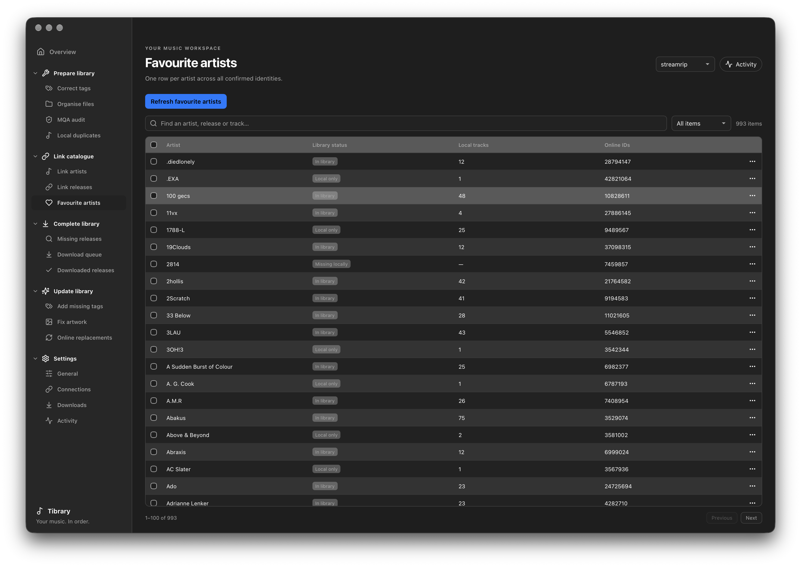

# Tibrary 🎵

**Tibrary** is a local-first desktop application for macOS designed to manage, verify, and complete your local music collection for DJs with local music collections. It links your local files to an *online streaming catalogue* (👀), identifies missing releases or incomplete albums, and allows you to safely perform ID3 tag, artwork, and folder operations so that locally downloaded files will match online catalogue releases.

🚨 Primarily built by **Gemini 3.8** and **GPT-6 Astra**, only small fixes and amendments have been done by me

  

## What It Does

Tibrary aims to: **scan once, match as many files as possible to the online catalogue automatically, review clearly, and change/add only with explicit approval.** Catalogue matching runs safely in the background; local files are only altered when you say so.

* **Smart Incremental Scanning:** Scans local directories for audio files and supports multiple drives/libraries.

* **Deterministic Catalogue Linking:** Matches your local releases to remote catalogue entities by analysing individual track and whole release tags, album/EP/single structures, ISRCs, durations, and mix versions (deluxe, remix etc.) together, never guessing based purely on track title and artist and allowing manual release/artist linking.

  

* **Missing Music Detection:** Automatically maps artist discographies to find gaps between existing releases, flag incomplete albums, and discover new releases.

  

* **Safe Library Maintenance & Duplicate Handling:** Preview date normalizations, track zero-padding (`01` vs `1`), Camelot `INITIALKEY` conversions, and tag-based folder reorganization before writing any changes to disk. Easily inspect potential duplicate releases and replacements across your local disk.

  

* **MQA Audit:** Includes a read-only 36-bit stereo-XOR protocol check to detect MQA audio streams in FLAC files, allowing you to manually review them for deletion or replacement.

  

* **Background Processing & Real-Time Activity:** Non-blocking background worker processes metadata searches, artist links, and file inspection in real time without locking the UI.

  

* **Isolated Download Queue:** Send missing tracks to a persistent acquisition checklist. Approved items can be exported as URLs or handed off to an isolated background download runtime.

---

## The Workflow

### 1. Prepare & Clean Library
Scan folders to reconcile modified or added files, inspect folder layouts, audit for unwanted MQA streams, and resolve local duplicate tracks before linking.

  

### 2. Match Catalogue & Reconcile Artists
Resolve artist profiles across multi-artist collaborations, alias variations, and split tracks.

  

### 3. Link Releases Deterministically
Map local tracks to definitive streaming catalog releases using ISRC matching, track lengths, and edition selections without altering your audio tags directly.

  

### 4. Spot Missing Music & Queue
Audit discographies of favourite artists, pinpoint uncollected releases, singles, or bonus tracks, and stage them for retrieval.

---

## Installation & Setup

The rebuilt application uses **Tauri + Python**, with Rust services for metadata, audio verification and MQA analysis. The previous Qt interface is archived in `archive/qt/`.

On Apple Silicon Macs running macOS 13 or later, open the built **Tibrary.app**, or open the DMG under `desktop/src-tauri/target/release/bundle/dmg/` and drag Tibrary to Applications. The packaged app includes its private Python runtime. In this checkout, double-click `Start.command` to launch it.

Existing library records, cached links and account sessions are retained. Configure accounts in **Settings → Connections**, and download location, folder structure and audio quality in **Settings → Downloads**.

See [Development and setup](support/docs/DEVELOPMENT.md) for source builds, testing and the isolated demo. Local builds are not yet Developer ID signed or notarized for public distribution.

---

## Credits

* [**Lofty**](https://github.com/Serial-ATA/lofty-rs)
* [**Mutagen**](https://mutagen.readthedocs.io/?utm_source=gemini)
* [**Tidaler**](https://github.com/?utm_source=gemini)
* [**python-tidal**](https://github.com/tamland/python-tidal?utm_source=gemini)
* [**AudioAuditor**](https://github.com/Angel2mp3/AudioAuditor?utm_source=gemini)
* **MQA Reverse Engineering** by [purpl3F0x](https://github.com/purpl3F0x/MQA_identifier?utm_source=gemini) and [Dniel97](https://github.com/Dniel97/MQA-identifier-python?utm_source=gemini)