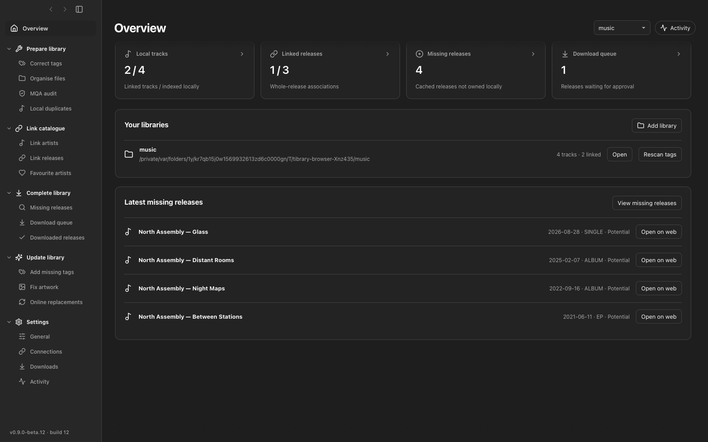
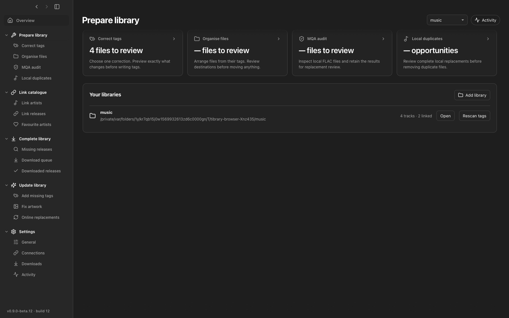
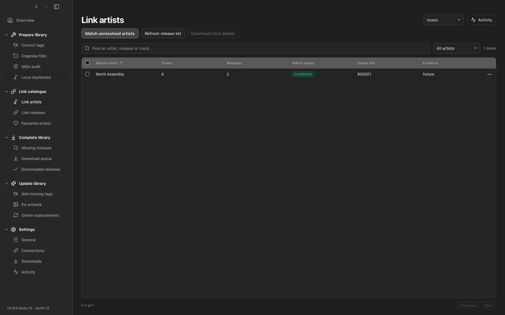
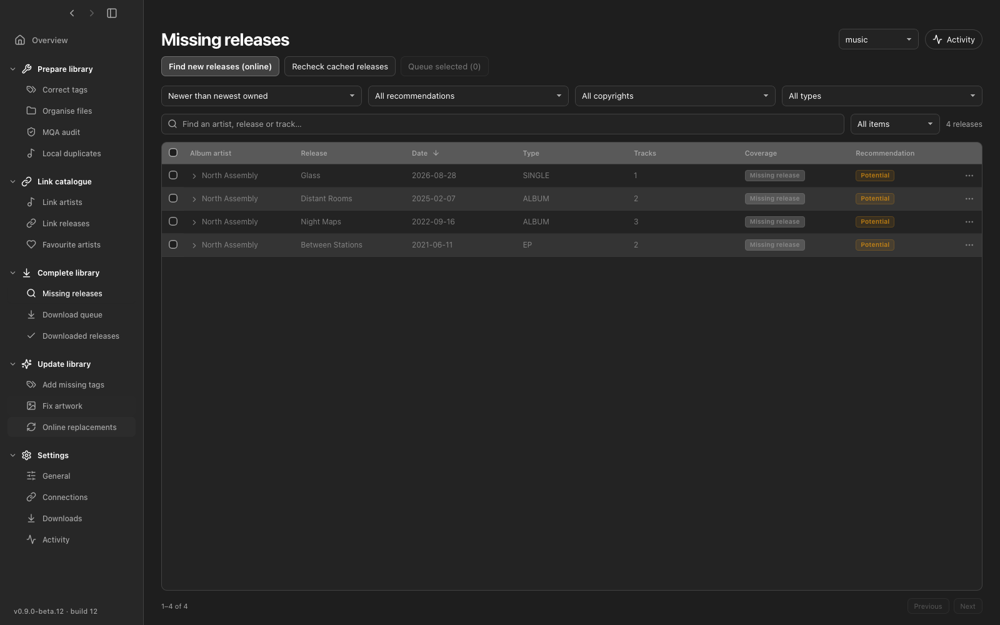
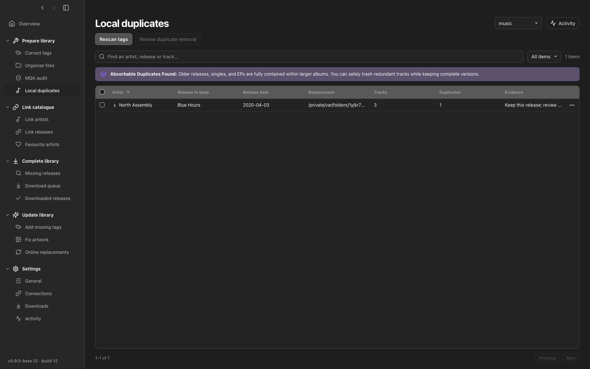
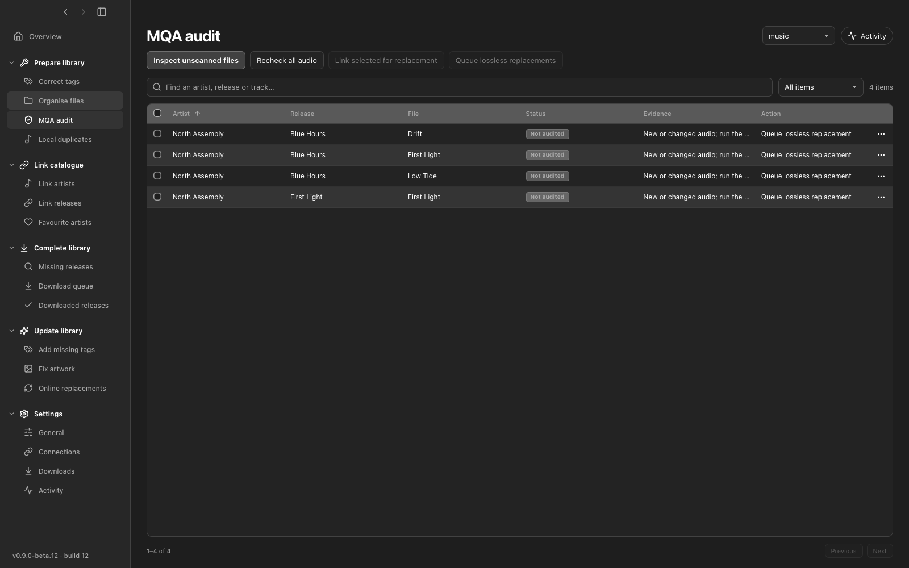

<div align="center">

# Tibrary 🎵

**A modern, local-first music library manager and catalogue companion app.**

[](https://www.rust-lang.org/)
[](https://v2.tauri.app/)
[](https://react.dev/)
[](LICENSE)

<br/>


</div>

---

## 🌟 Overview

**Tibrary** matches your local music files against official online releases to give your collection rich, comprehensive tags and help you discover new music.

By pairing your local albums and tracks with their streaming counterparts, Tibrary can fill available metadata—including release dates, artwork, disc numbers, Camelot keys and BPM. It also caches track credits, with contributor names and roles, to support release matching and recommendations. Availability depends on what the provider returns; missing credits never become invented metadata.

**Scan your library, review proposed changes, and approve edits before they touch your files.** Duplicate removal uses the system Trash. Catalogue linking itself changes only the app database.

---

## ✨ Features

- ⚡ **Fast Library Scanning:** Quickly scans your local music folders (FLAC, ALAC, MP3, WAV, AIFF) and checks for new or modified files.
- 🎯 **Accurate Catalogue Matching:** Matches your tracks and albums to official online releases using song titles, track lengths, album structure, and ISRCs to fetch comprehensive tags without guessing.
- 🔍 **Track New & Missing Releases:** Compares your local collection against full artist discographies to spot missing albums, bonus tracks, or newly released music.
- 🔬 **MQA Audio Audit:** Scans lossless FLAC files to identify authentic MQA streams so you can easily review, keep, or replace them.
- 🗃️ **Duplicate Finder:** Detects duplicate tracks and alternative releases across your folders, comparing audio formats and quality so you can keep the best copy.
- 🏷️ **Safe Tag & Folder Organization:** Standardizes track numbers, adds Camelot keys and BPM, and organizes folders into clean structures (`Artist/Album (Year)/Track - Title`). Changes are previewed first, and tags are updated without altering your audio quality.
- 📋 **Acquisition Queue:** Keep a checklist of missing tracks or releases you want to collect, with options to export lists or manage approved items.
- ⬇️ **Reviewed Downloads:** Download approved audio with bounded parallel transfers, per-track progress, and recoverable redownloads. Local preparation remains available during downloads.
- 📊 **Clear Activity:** Follow local work, catalogue checks and downloads in separate live panels, with independent search and history controls.
- 🧭 **Flexible Workspace:** Use back and forward navigation beside the window controls. Hide the sidebar to give the current page the full window width; navigation stays available.
- 🧩 **Credit Evidence:** Shared composers, songwriters, producers and other credited contributors can support recommendations. Only current verified local links or local tags provide reference evidence; shared names never override recording or release-structure conflicts. Credits, including empty results, are cached for reuse.

---

## 🖼️ Visual Tour

Screenshots below use a disposable sample library.

<div align="center">
  
</div>

### 1. Prepare & Clean Library
Inspect your library, scan for modified files, audit for MQA streams, and resolve duplicate tracks.
<div align="center">
  
</div>

<br/>

### 2. Link Artists
Match album artists from local tags to online artist profiles across collaborations and alias variations.
<div align="center">
  
</div>

<br/>

### 3. Match Releases
Pair local tracks with official releases to review track mappings, lengths, and album editions.
<div align="center">
  
</div>

<br/>

### 4. Spot Missing Music & Track New Releases
Audit artist discographies to find uncollected releases or new singles and add them to your queue.
<div align="center">
  
</div>

<br/>

### 5. Review Local Duplicates
Compare audio formats, bit depths, and sample rates to clean up duplicate files safely.
<div align="center">
  
</div>

<br/>

### 6. MQA Audio Audit
Inspect FLAC audio frames to detect authentic MQA encoding.
<div align="center">
  
</div>

---

## 🚀 Quick Start

```sh
brew install ffmpeg

# Install frontend dependencies
npm --prefix desktop ci

# Launch the app in development
npm --prefix desktop run tauri dev
```

On macOS, you can also launch the prebuilt application directly using `./Start.command`.

To build a local macOS application with Node.js and the Rust toolchain installed:

```sh
npm --prefix desktop run tauri build -- --bundles app
open desktop/src-tauri/target/release/bundle/macos/Tibrary.app
```

---

## 🙏 Credits & Attributions

- [**Lofty**](https://github.com/Serial-ATA/lofty-rs) — Audio tagging and metadata library in Rust.
- [**Tauri**](https://v2.tauri.app/) — Desktop application framework.
- [**Turso / libsql**](https://github.com/tursodatabase/libsql) — Embedded SQLite database engine.
- [**AudioAuditor**](https://github.com/Angel2mp3/AudioAuditor) by Angel2mp3 — MQA signal detection reference.
- **MQA Reverse Engineering Credits** — Pioneered by [purpl3F0x](https://github.com/purpl3F0x/MQA_identifier) and [Dniel97](https://github.com/Dniel97/MQA-identifier-python).

---

## 📄 License

This project is licensed under the [MIT License](LICENSE).
