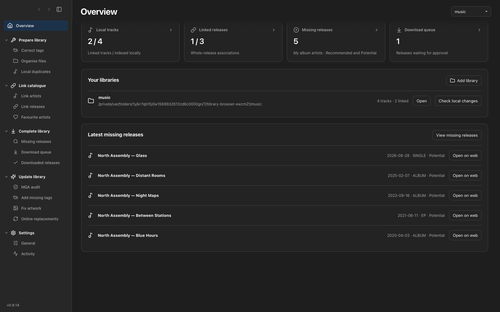
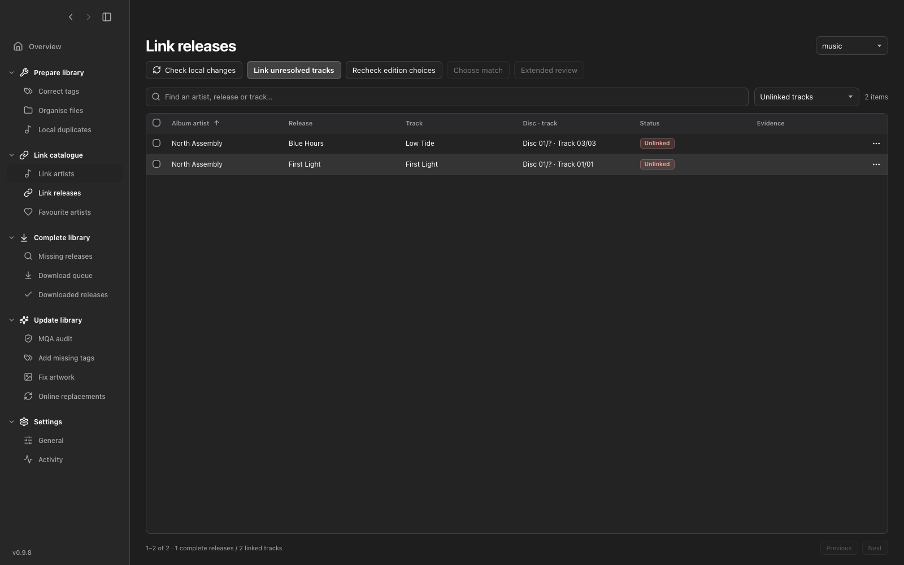
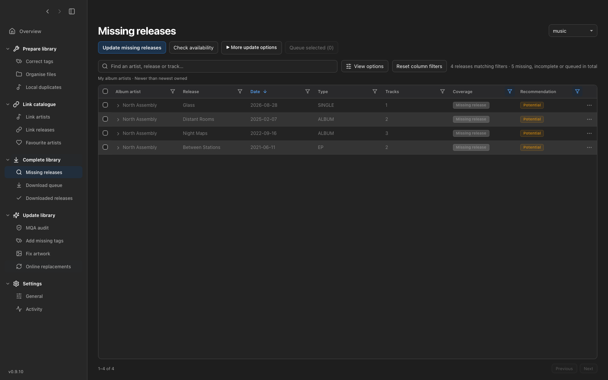
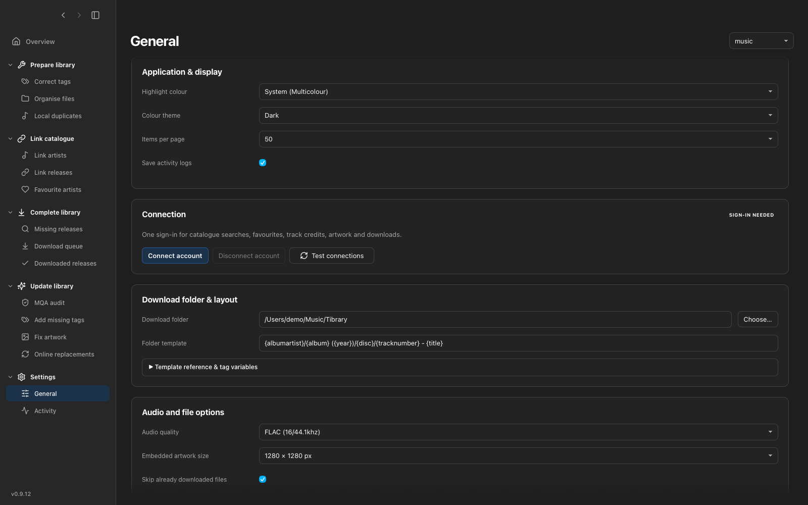
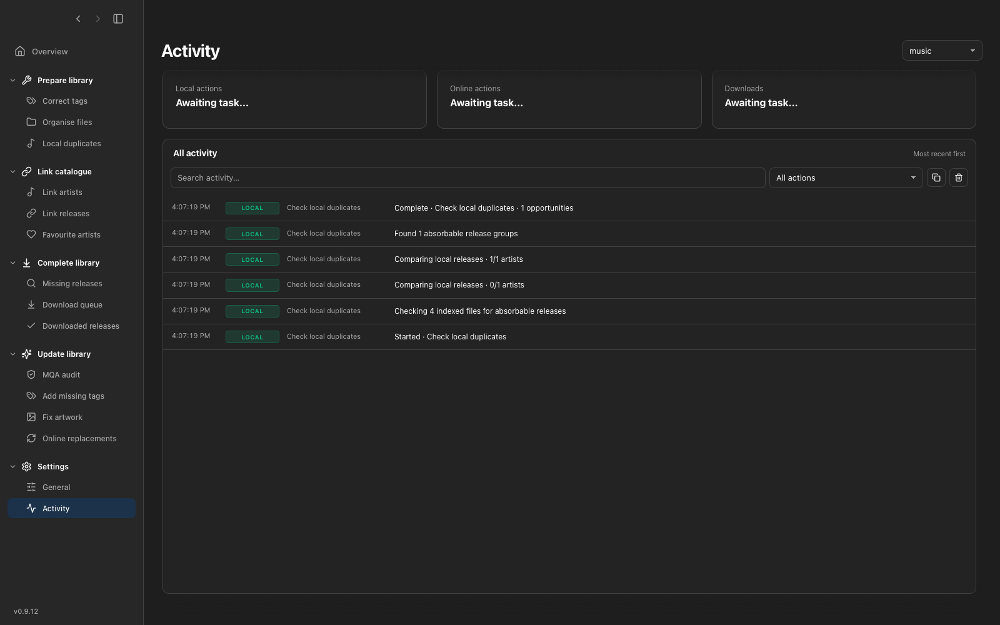

<div align="center">


# Tibrary

A local-first music library manager for macOS, built with Rust and Tauri.

**Clean up your files, link your collection, and find missing music.**
</div>



## What it does

- **Prepare your library:** preview tag corrections, organise folders and review local duplicates.
- **Link your collection:** match album artists, recordings and whole releases using cached catalogue evidence.
- **Find missing music:** discover new releases and incomplete albums, filter recommendations, and queue selected tracks.
- **Update your files:** fill available tags—including BPM and Camelot keys—improve artwork, and audit MQA files.
- **Follow the work:** one searchable activity log with action filters, saved details and separate cancellation controls for local tasks, online checks and downloads.

Linking only updates the app database. File changes are reviewed separately; duplicate removal uses Trash. One subscriber account supplies catalogue metadata and downloads. Available metadata varies by release.

Catalogue availability follows your account country. The default highlight colour follows macOS; the standard colours and Graphite can also be selected in Settings.

## Run on your Mac

Install Xcode Command Line Tools, a current stable [Rust toolchain](https://rustup.rs/), and Node.js LTS. Then, from this repository:

```sh
brew install node ffmpeg
npm --prefix desktop ci
npm --prefix desktop run tauri build -- --bundles app
open desktop/src-tauri/target/release/bundle/macos/Tibrary.app
```

After building, use **Start.command** to reopen the app. Releases contain source code only; binaries are built locally.

For development:

```sh
npm --prefix desktop run tauri dev
```

## Getting started

1. Add a music folder on **Overview**.
2. Use **Prepare library** to review local tags and folder layout.
3. Sign in under **Settings → General → Connection**, then use **Link catalogue**.
4. Browse **Complete library → Missing releases** and queue the music you want.
5. Use **Update library** for missing tags, artwork and replacements.

Use **Check local changes** after editing files outside the app, and **Update missing releases** to discover new music and fill gaps in online metadata. Recommendation updates first complete metadata for your downloaded, linked releases, then fill candidate gaps. Tools share their cached results; unchanged tags and checked track credits are reused. Metadata views show which fields were checked, and artist scope and recommendation confidence can be filtered separately. The normal view includes Recommended and Potential releases; fully checked releases with no shared identity evidence are available by checking **Suspect** or **Select all** in the Recommendation column menu. Your database does not need resetting.

Filter any main table using checkmarked values in its column headers; multiple values and columns can be combined. Missing releases keeps album-artist scope and release range in **View options**.

In **MQA audit**, the arrow beside **Scan** selects all releases or only unscanned tracks. Adjust individual checkmarks before scanning. **Find online matches** identifies selected MQA recordings; **Queue replacements** adds matched tracks to the download queue for approval.

Browse cached releases and manage the queue while updates run. Expanding a release loads missing track details on demand; downloads and local scans run independently. File-changing operations wait for active downloads to finish.

## Screenshots

Captured from the current UI with a disposable sample library.

| Link releases | Missing releases |
| --- | --- |
|  |  |

| General settings | Activity |
| --- | --- |
|  |  |

See the [guide](desktop/docs/DOCUMENTATION.md) for workflows, cache behaviour and development checks.

## Credits and licence

Built with [Tauri](https://v2.tauri.app/), [React](https://react.dev/), [Lofty](https://github.com/Serial-ATA/lofty-rs) and [Turso](https://github.com/tursodatabase/turso).

MQA detection references: [AudioAuditor](https://github.com/Angel2mp3/AudioAuditor), [purpl3F0x](https://github.com/purpl3F0x/MQA_identifier) and [Dniel97](https://github.com/Dniel97/MQA-identifier-python).

Subscriber API and download references: [Tidaler](https://github.com/maya-doshi/tidaler) and [Minim](https://minim.readthedocs.io/en/latest/_modules/minim/tidal.html).

[MIT licence](LICENSE).
